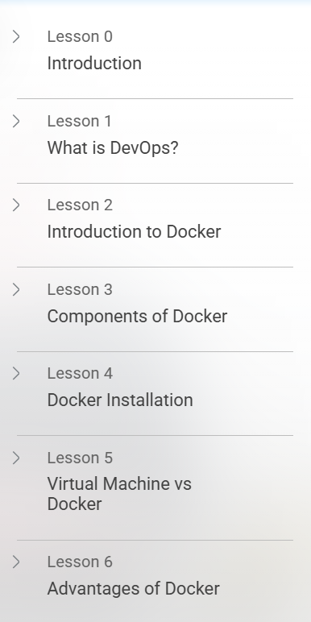
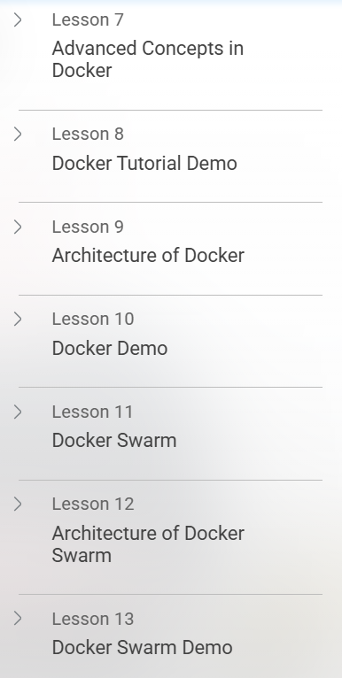
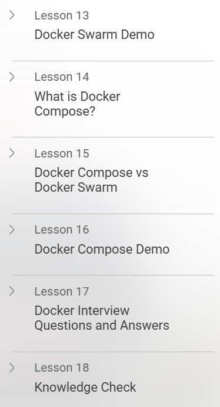

# 🐳 Getting Started with Docker – Simplilearn

This repository contains **notes, labs, insights, supplements, resources, and a certificate of completion**  
for the *Getting Started with Docker* course by **Simplilearn**.  
It covers the fundamentals of **containers, Docker architecture, images, volumes, networking, and best practices**.

---

## 📚 Notes
- 📄 [01-introduction.md](./notes/01-introduction.md) – Introduction to Docker  
- 📄 [02-docker-architecture.md](./notes/02-docker-architecture.md) – Docker architecture  
- 📄 [03-working-with-containers.md](./notes/03-working-with-containers.md) – Running and managing containers  
- 📄 [04-images-and-dockerfile.md](./notes/04-images-and-dockerfile.md) – Docker images & Dockerfile  
- 📄 [05-networking-and-volumes.md](./notes/05-networking-and-volumes.md) – Networking & data persistence  
- 📄 [06-docker-compose.md](./notes/06-docker-compose.md) – Multi-container apps with Docker Compose  
- 📄 [07-best-practices.md](./notes/07-best-practices.md) – Best practices in containerization  

---

## 🔬 Extras
- 📑 [case-studies.md](./extras/case-studies.md) – Real-world Docker use cases  
- 📑 [resources.md](./extras/resources.md) – References & learning resources  
- 📆 [timeline.md](./extras/timeline.md) – Docker development timeline  

---

## 💡 Insights
- 🏭 [industry-usecases.md](./insights/industry-usecases.md) – Industry adoption of Docker  
- 📊 [case-studies.md](./insights/case-studies.md) – Case studies in containerization  
- 📈 [docker-trends.md](./insights/docker-trends.md) – Current Docker trends & ecosystem  

---

## 📦 Supplement
- ✅ [best-practices.md](./supplement/best-practices.md) – Best practices in Docker usage  
- 📚 [resources.md](./supplement/resources.md) – Extra learning materials  
- 🕒 [timeline.md](./supplement/timeline.md) – Supplementary Docker timeline  

---

## 📖 Docs
- 📘 [index.md](./docs/index.md) – Program overview  
- 📘 [glossary.md](./docs/glossary.md) – Glossary of Docker terms  
- 📘 [references.md](./docs/references.md) – External references  
- 📘 [roadmap.md](./docs/roadmap.md) – Learning roadmap  
- 📘 [syllabus.md](./docs/syllabus.md) – Course syllabus  

---

## 📸 Screenshots

| Lesson | Screenshot |
|--------|------------|
| 📚 Lesson 1 |  |
| 🔍 Lesson 2 |  |
| 🧩 Lesson 3 |  |

---

## 📜 Certificate
🎓 [Certificate of Completion – Getting Started with Docker](./cert/Getting%20Started%20with%20Docker.pdf)  

---

## 📝 Personal Review
This course helped me gain a **practical introduction to Docker and containerization**.  
I learned about **Docker architecture, images, containers, volumes, and Compose**,  
and explored **real-world use cases** through insights and case studies.  
The course built a strong foundation for future learning in **DevOps and cloud-native development**.  

---

## ✍️ Author
**Thành Danh** – Red Team Learner & Security Researcher  

- GitHub: [@ngvuthdanhh](https://github.com/ngvuthdanhh)  
- Email: ngvu.thdanh@gmail.com  

---

## 📄 License
This project is licensed under the terms of the **MIT License**. See [LICENSE](./LICENSE) for full details.  
© 2025 ngvuthdanhh. All rights reserved.  
